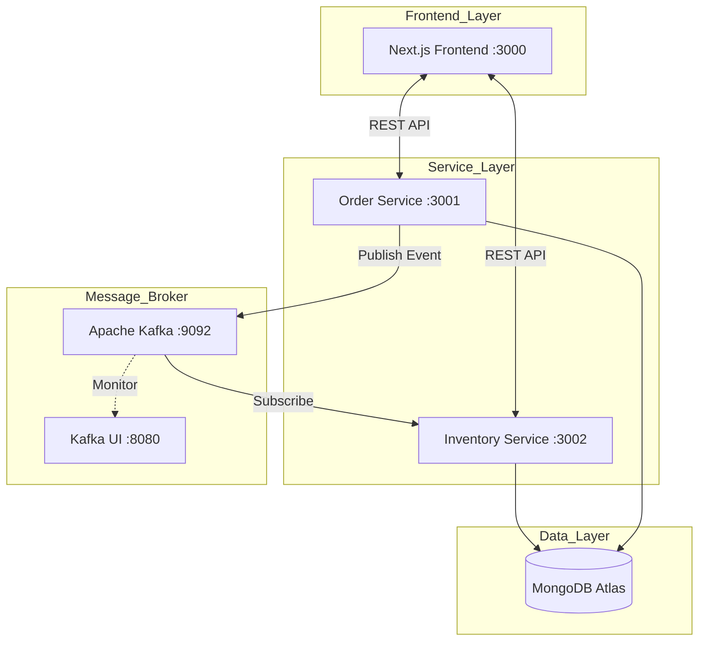

<div align="center">

  <!-- Header với tiêu đề mới -->
  

  <!-- Link và hiệu ứng chữ chạy -->
  <a href="https://github.com/phatle224/micro_books">
    
  </a> 

  <p align="center">
    
    
    
    
  </p>

  <p align="center">
    
    
    
    
  </p>

</div>

# 📚 MicroBooks — Bookstore Management System (v2.0)

Hệ thống quản lý bán sách áp dụng kiến trúc **Microservices** hiện đại, giao tiếp bất đồng bộ qua **Apache Kafka**, lưu trữ dữ liệu trên **MongoDB Atlas** và tích hợp quy trình **CI/CD tự động** trên máy local.

---

## 🏗️ Kiến trúc Hệ thống



---

## 🛠️ Tech Stack & DevOps

### Core Technologies
<p align="left">
  <a href="https://skillicons.dev">
    
  </a>
</p>

| Thành phần | Công nghệ |
|-----------|------------|
| **Frontend** | Next.js 15 (App Router), Tailwind CSS |
| **Backend** | Python 3.10+, FastAPI |
| **Database** | MongoDB Atlas (Cloud) |
| **Message Broker** | Apache Kafka & Zookeeper |
| **Infrastructure** | Docker, Docker Compose, Kubernetes (Kustomize) |
| **CI/CD** | GitHub Actions (Self-hosted Runner) |
| **Observability** | OpenTelemetry, Prometheus, Grafana, Loki, Tempo |

---

## 📁 Cấu trúc dự án

```bash
MicroBooks/
├── .github/workflows/          # Quy trình CI/CD (Local Deployment)
├── frontend/                   # Next.js Frontend Application
├── order_service/              # Dịch vụ Quản lý Đơn hàng (Python)
├── inventory_service/          # Dịch vụ Quản lý Kho (Python)
├── tests/                      # Kiểm thử tích hợp (Integration Tests)
├── docs/                       # Tài liệu thiết kế (PRD, Design)
├── k8s/                        # Kubernetes Manifests
└── docker-compose.yml          # Orchestration configuration
```

---

## 🚀 Quy trình CI/CD (Self-hosted Runner)

Hệ thống đã được tích hợp quy trình **Automation** hoàn chỉnh:
1. **Continuous Integration (CI):** Tự động kiểm tra code và chạy unit tests khi có Pull Request hoặc Push vào branch `main`.
2. **Continuous Deployment (CD):** Sử dụng **GitHub Actions Self-hosted Runner** cài đặt trực tiếp trên máy chủ local. 
   - Khi CI thành công, Runner sẽ tự động `docker-compose pull` và `docker-compose up -d`.
   - Đảm bảo môi trường local luôn đồng bộ với code mới nhất trên GitHub mà không cần thao tác tay.

> Xem chi tiết tại: [local-deploy.yml](.github/workflows/local-deploy.yml)

---

## 🛠️ Hướng dẫn cài đặt

### Chạy bằng Docker Compose (Khuyên dùng)

```bash
# 1. Clone repo
git clone https://github.com/phatle224/micro_books.git
cd micro_books

# 2. Cấu hình môi trường
cp .env.example .env

# 3. Khởi chạy
docker-compose up --build -d
```

### Chạy bằng Kubernetes (K8s)

```bash
# 1. Triển khai toàn bộ hệ thống
kubectl apply -k k8s/base

# 2. Port-forward để truy cập Frontend
kubectl port-forward svc/frontend 3000:3000 -n microbooks
```

---

## 🔗 Các dịch vụ & API

| Service | URL | Mô tả |
|---------|-----|-------|
| **Storefront** | [http://localhost:3000](http://localhost:3000) | Giao diện mua sắm |
| **Admin Portal** | [http://localhost:3000/admin](http://localhost:3000/admin) | Quản lý hệ thống |
| **Kafka UI** | [http://localhost:8080](http://localhost:8080) | Giám sát hàng đợi |
| **Order Docs** | [http://localhost:3001/docs](http://localhost:3001/docs) | Swagger UI (Order) |
| **Inventory Docs** | [http://localhost:3002/docs](http://localhost:3002/docs) | Swagger UI (Inventory) |
| **Grafana** | [http://localhost:3005](http://localhost:3005) | Dashboard (admin/admin) |

---

## 👥 Tác giả

<table align="center">
  <tr>
    <td align="center">
      <a href="https://github.com/Kietnehi">
        <br />
        <sub><b>Trương Phú Kiệt</b></sub>
      </a><br />
      
    </td>
    <td align="center">
      <a href="https://github.com/phatle224">
        <br />
        <sub><b>Phát Lê</b></sub>
      </a><br />
      
    </td>
  </tr>
</table>

<p align="center">
  
  
</p>

---

<div align="center">

  <!-- Quote động -->
  

  <p>
    <i>Thank you for stopping by! Don't forget to give this repo a <b>⭐️ Star</b> if you find it useful.</i>
  </p>

  
</div>
