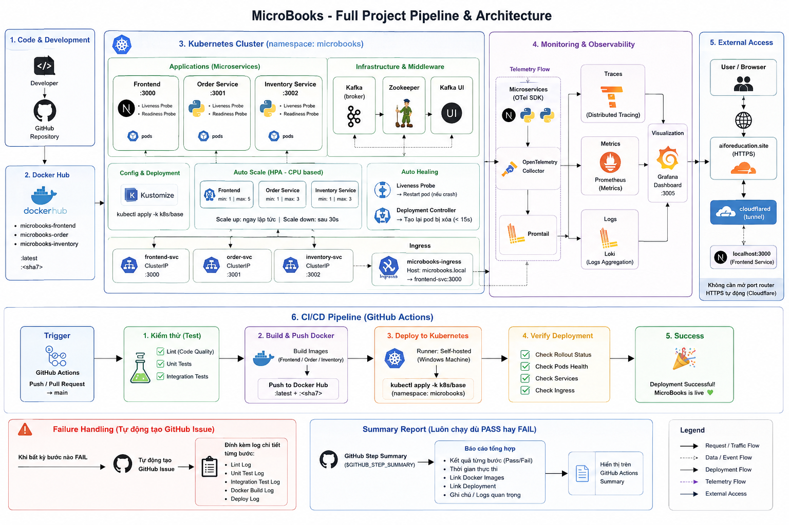
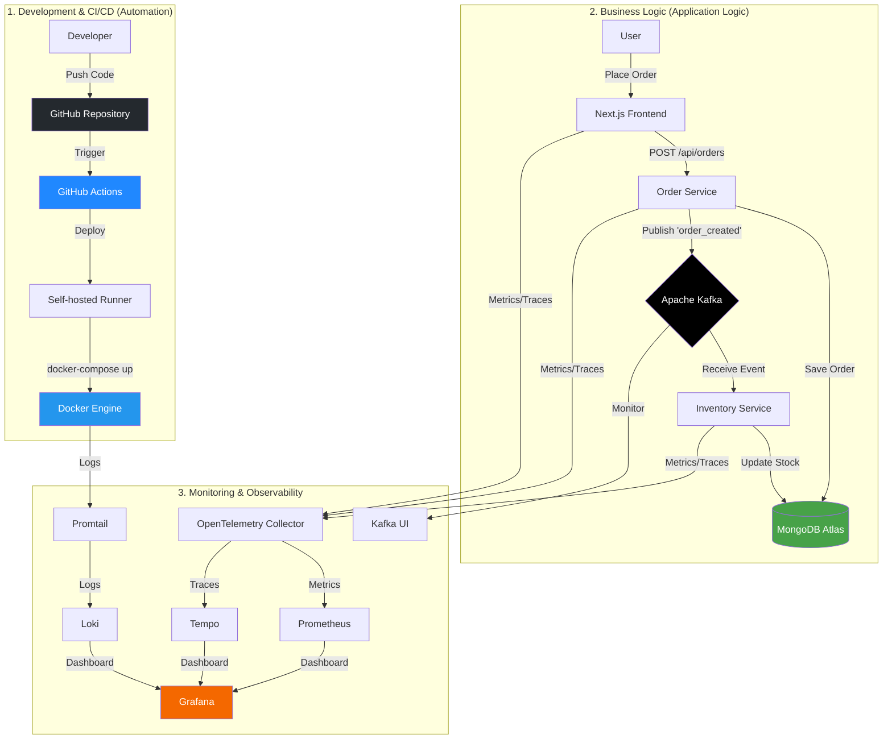

<div align="center">

<!-- Header with new title -->


<!-- Link and Typing SVG effect -->

<a href="https://github.com/phatle224/micro_books">
    
  </a>

<!-- Badges -->

<p align="center">
    <a href="https://github.com/phatle224/micro_books/blob/main/LICENSE">
      
    </a>
    
    
    
    
    
    
  </p>

</div>

# 📚 MicroBooks — Bookstore Management System (v2.0)

**MicroBooks v2.0** is a production-grade, event-driven microservices system built with FastAPI, Next.js, and Apache Kafka. It features an automated CI/CD pipeline via GitHub Actions and a comprehensive observability stack. Containerized with Docker and Kubernetes-ready, it provides a robust, scalable environment for modern software development.

---

Modern Microservices-based bookstore management system using **Apache Kafka** for asynchronous communication, **MongoDB Atlas** for cloud storage, and integrated automated **CI/CD pipelines** for local deployment.

<p align="center">
  
</p>

## 🏗️ System Architecture

```
┌─────────────┐     REST API     ┌─────────────────┐
│   Frontend  │◄────────────────►│  order_service  │
│  (Next.js)  │                  │  (FastAPI:3001) │
│   :3000     │     REST API     │                 │
│             │◄──────┐         └────────┬─────────┘
└─────────────┘       │                  │ Publish
                      │                  ▼
               ┌──────┴────────┐  ┌──────────────┐
               │ inventory_    │◄─┤ Apache Kafka │
               │ service       │  │   :9092      │
               │ (FastAPI:3002)│  └──────┬───────┘
               └───────┬───────┘         │ Monitor
                       │          ┌──────▼───────┐
                       │          │   Kafka UI   │
                       │          │    :8080     │
                       ▼          └──────────────┘
               ┌──────────────┐
               │ MongoDB Atlas│
               └──────────────┘
```

## 🔄 Full System Workflow

Below is a detailed diagram of the operational flow, from code push to user interaction and automated monitoring:



## 🛠️ Tech Stack & DevOps

| Component                | Technology                                          |
| ------------------------ | --------------------------------------------------- |
| **Frontend**       | Next.js 15 (App Router), Tailwind CSS               |
| **Backend**        | Python 3.10+, FastAPI                               |
| **Database**       | MongoDB Atlas (Cloud)                               |
| **Message Broker** | Apache Kafka & Zookeeper                            |
| **Monitoring**     | Kafka UI (provectuslabs)                            |
| **Infrastructure** | Docker & Docker Compose                             |
| **CI/CD**          | GitHub Actions (Self-hosted Runner)                 |
| **Observability**  | OpenTelemetry + Prometheus + Grafana + Loki + Tempo |

## 📁 Project Directory Structure

```bash
MicroBooks/
├── .github/workflows/          # CI/CD Workflows (Local Deployment)
├── frontend/                   # Next.js Frontend Application
├── order_service/              # Order Management Service (Python)
├── inventory_service/          # Inventory Management Service (Python)
├── tests/                      # Integration Tests
├── docs/                       # Design Documentation (PRD, Design)
├── docs_self_host_runner/      # CI/CD Runner Configuration Docs
├── k8s/                        # Kubernetes Manifests (Kustomize)
│   └── base/                   # Base configuration
├── .env                        # Environment Variables
└── README.md
```

## 🚀 CI/CD Workflow (Self-hosted Runner)

The system is integrated with a complete **Automation** workflow:

1. **Continuous Integration (CI):** Automatically validates code and runs unit tests upon Pull Request or push to the `main` branch.
2. **Continuous Deployment (CD):** Uses a **GitHub Actions Self-hosted Runner** installed directly on the local server.
   - Upon successful CI, the Runner automatically executes `docker-compose pull` and `docker-compose up -d`.
   - Ensures the local environment is always synchronized with the latest code on GitHub without manual intervention.

> View details at: [local-deploy.yml](.github/workflows/local-deploy.yml)

## 🛠️ Installation Guide

### Run with Docker Compose (Recommended)

```bash
# 1. Clone repo
git clone https://github.com/phatle224/micro_books.git
cd micro_books

# 2. Environment Configuration
cp .env.example .env
# Update MONGO_URI and DOCKER_HUB_USERNAME in .env

# 3. Launch
docker-compose up --build -d
```

### Run with Kubernetes (K8s)

Ensure Kubernetes is enabled in Docker Desktop or Minikube.

```bash
# 1. Deploy the entire system
kubectl apply -k k8s/base

# 2. Wait until all Pods are in Running state
kubectl get pods -n microbooks -w

# 3. Port-forward to access the Frontend (run in a separate terminal)
kubectl port-forward svc/frontend 3000:3000 -n microbooks

# 4. Stop and remove all resources
kubectl delete -k k8s/base
```

### Service Access

| Service                      | URL                                                     | Description                    |
| ---------------------------- | ------------------------------------------------------- | ------------------------------ |
| **Storefront**         | [http://localhost:3000](http://localhost:3000)             | Shopping Interface             |
| **Admin Portal**       | [http://localhost:3000/admin](http://localhost:3000/admin) | System Administration          |
| **Kafka UI**           | [http://localhost:8080](http://localhost:8080)             | Message Queue Monitoring       |
| **Order API Docs**     | [http://localhost:3001/docs](http://localhost:3001/docs)   | Swagger UI (Order Service)     |
| **Inventory API Docs** | [http://localhost:3002/docs](http://localhost:3002/docs)   | Swagger UI (Inventory Service) |

## 📊 Kafka Monitoring (User Access)

```bash
# Terminal 1: Order Service
cd order-service
pip install -r requirements.txt
uvicorn app.main:app --port 3001 --reload

# Terminal 2: Inventory Service
cd inventory-service
pip install -r requirements.txt
uvicorn app.main:app --port 3002 --reload

# Terminal 3: Frontend
cd frontend
npm install
npm run dev
```

### Access URLs

| Service               | URL                                            |
| --------------------- | ---------------------------------------------- |
| Frontend              | http://localhost:3000                          |
| Order Service API     | http://localhost:3001/api/orders (Docs: /docs) |
| Inventory Service API | http://localhost:3002/api/books (Docs: /docs)  |
| Kafka UI              | http://localhost:8080                          |

## 📈 Monitoring & Observability

The observability stack is pre-configured using OpenTelemetry + Prometheus + Grafana + Loki + Tempo.

### Access URLs

| Service    | URL                                   |
| ---------- | ------------------------------------- |
| Grafana    | http://localhost:3005 (admin / admin) |
| Prometheus | http://localhost:9090                 |
| Loki       | http://localhost:3100                 |
| Tempo      | http://localhost:3200                 |

### Quick Notes

- Order/Inventory services have OpenTelemetry enabled when running via Docker Compose.
- Metrics are pushed through the OpenTelemetry Collector and scraped by Prometheus.
- Logs are collected using Promtail (docker logs) and displayed via Loki.
- Traces are stored in Tempo and can be viewed in Grafana Explore.

## 🔐 Administration (Admin Portal)

You can access the admin portal to manage the bookstore, orders, and monitor Kafka:

- **URL:** `http://localhost:3000/admin/login`
- **Username:** `admin@microbooks.com`
- **Password:** `admin123`

| Page              | Description                       |
| ----------------- | --------------------------------- |
| `/admin`        | General Dashboard                 |
| `/admin/books`  | Book Inventory Management         |
| `/admin/orders` | Order Management                  |
| `/admin/kafka`  | Kafka Monitor (embedded Kafka UI) |

## 📡 API Endpoints

### Order Service (Port 3001)

| Method | Endpoint                      | Description              |
| ------ | ----------------------------- | ------------------------ |
| GET    | `/api/orders`               | Get all orders           |
| GET    | `/api/orders/{id}`          | Get order details        |
| POST   | `/api/orders`               | Create new order         |
| PATCH  | `/api/orders/{id}`          | Update status            |
| GET    | `/api/orders/stats/summary` | Order statistics (Admin) |

### Inventory Service (Port 3002)

| Method | Endpoint                     | Description                  |
| ------ | ---------------------------- | ---------------------------- |
| GET    | `/api/books`               | Get all books                |
| GET    | `/api/books/{id}`          | Get book details             |
| POST   | `/api/books`               | Add new book                 |
| PUT    | `/api/books/{id}`          | Update book                  |
| DELETE | `/api/books/{id}`          | Delete book                  |
| GET    | `/api/books/categories`    | Get book categories          |
| GET    | `/api/books/stats/summary` | Inventory statistics (Admin) |

## ⚡ Event-Driven Workflow

1. Client creates an order → **Order Service** saves it to MongoDB Atlas.
2. Order Service publishes an `order_created` event to the **Kafka topic**.
3. **Inventory Service** subscribes to the topic and receives the event.
4. Inventory Service automatically deducts stock for the corresponding book in MongoDB Atlas.
5. All broker activity can be monitored real-time via **Kafka UI** at `localhost:8080` or the `/admin/kafka` page.

## 📊 Kafka Monitoring

The system integrates **[Kafka UI](https://github.com/provectus/kafka-ui)** for message flow observation:

- **Brokers** — View broker status, replicas, and partitions.
- **Topics** — Browse messages in the `order_created` topic.
- **Consumer Groups** — Monitor lag for the `inventory-service-group`.
- **Schema Registry** — Manage schemas (if applicable).

> Kafka UI is embedded directly into the Admin page at `/admin/kafka` and can also be opened separately at `http://localhost:8080`.

We provide an intuitive interface for users and developers to track event-driven flows:

- **Kafka UI:** Access at [http://localhost:8080](http://localhost:8080).
- Here you can view topics like `order_created`, inspect message payloads, and monitor the status of Consumers (Inventory Service).

## 🔗 Authors & GitHub Profiles

<p align="center">
  
</p>

|                                                                                                                                                                                                                                                                                                                                                                                                                                                                                      |                                                                                                                                                                                                                                                                                                                                                                                                                                                                                          |
| :-----------------------------------------------------------------------------------------------------------------------------------------------------------------------------------------------------------------------------------------------------------------------------------------------------------------------------------------------------------------------------------------------------------------------------------------------------------------------------------: | :--------------------------------------------------------------------------------------------------------------------------------------------------------------------------------------------------------------------------------------------------------------------------------------------------------------------------------------------------------------------------------------------------------------------------------------------------------------------------------------: |
|                                                                                                                                `<a href="https://github.com/Kietnehi">``</a>`                                                                                                                                |                                                                                                                                 `<a href="https://github.com/phatle224">``</a>`                                                                                                                                 |
|                                                                                                                                                                                                              ``                                                                                                                                                                                                              |                                                                                                                                                                                                               ``                                                                                                                                                                                                               |
|                                                                                                                                                                                                         `<b><a href="https://github.com/Kietnehi">`Kiet Truong`</a></b>`                                                                                                                                                                                                         |                                                                                                                                                                                                            `<b><a href="https://github.com/phatle224">`Phat Le`</a></b>`                                                                                                                                                                                                            |
|                                                                                                                                                                                                                                Fullstack Dev & DevOps                                                                                                                                                                                                                                |                                                                                                                                                                                                                                 Data Engineer & Backend                                                                                                                                                                                                                                 |
| `<p align="center">` `` `<a href="https://github.com/Kietnehi">``</a></p>` | `<p align="center">` `` `<a href="https://github.com/phatle224">``</a></p>` |

<p align="center">
  <a href="https://github.com/phatle224/micro_books">
    
  </a>
</p>

<p align="center">
  
  
</p>

### 🛠 Tech Stack

<p align="center">
  
</p>

### 🐳 MICROBOOKS IN DOCKER

<p align="center">
  <a href="https://github.com/phatle224/micro_books">
    
    
    
  </a>
</p>

<!-- Dynamic Quote -->

<p align="center">
  
</p>

<p align="center">
  <i>Thank you for stopping by! Don’t forget to give this repo a <b>⭐️ Star</b> if you find it useful.</i>
</p>


