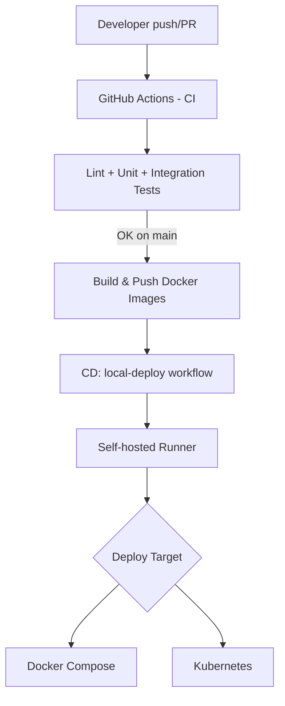

# Tóm tắt workflow CI/CD (Microbooks)

## Tổng quan
Workflow CI/CD bao gồm 2 phần: CI kiểm thử tự động và CD triển khai lên môi trường local (self-hosted runner). Toàn bộ được chạy trên GitHub Actions.

## Trigger
- CI: Push hoặc Pull Request vào nhánh `main`.
- CD: Tự động chạy sau khi CI thành công (workflow_run), hoặc chạy tay (workflow_dispatch).

## CI (Kiểm thử tự động)
Workflow: `.github/workflows/ci-cd.yml`

Các bước chính:
1. Checkout code.
2. Cài Python 3.11 và các dependency.
3. Lint (flake8).
4. Unit test cho `order_service` và `inventory_service`.
5. Khởi tạo hạ tầng test tích hợp:
   - Tạo `.env` tạm cho CI.
   - Chạy MongoDB (docker run).
   - Chạy Kafka/Zookeeper (docker compose).
6. Chạy 2 service bằng Uvicorn (background).
7. Integration test (tests/test_order_flow.py).
8. Nếu lỗi: upload log và tạo GitHub Issue tự động.
9. Tổng hợp kết quả vào GHA Step Summary.

## Build và push Docker Images
Trong CI, job đóng gói chỉ chạy khi push lên `main` và CI đã thành công.

- Build và push 3 image lên Docker Hub:
  - `microbooks-order-service`
  - `microbooks-inventory-service`
  - `microbooks-frontend`
- Tag: `latest` và short SHA (7 ký tự đầu của commit).

## CD (Triển khai local)
Workflow: `.github/workflows/local-deploy.yml`

Yêu cầu: Self-hosted runner chạy trên máy local.

Các bước chính:
1. Checkout code.
2. Restore file `.env` từ đường dẫn local `C:\Users\ADMIN\Desktop\micro_books\.env`.
3. Login Docker Hub.
4. Triển khai theo `DEPLOY_TARGET`:
   - `docker`: `docker-compose pull` và `docker-compose up -d`.
   - `k8s`: `kubectl apply -k k8s/base` và rollout restart các deployment.
   - `both`: chạy cả 2 cách.
5. Kiểm tra trạng thái bằng `docker ps` và `kubectl get pods -n microbooks`.

## Secrets và điều kiện tiên quyết
- Secrets bắt buộc:
  - `DOCKER_HUB_USERNAME`
  - `DOCKER_HUB_ACCESS_TOKEN`
- Self-hosted runner cần có: Docker, Docker Compose, kubectl, và quyền truy cập vào cluster K8s (nếu deploy k8s).
- File `.env` phải tồn tại ở đường dẫn local đã khai báo.

## Sơ đồ luồng (Mermaid)

## Ghi chú vận hành
- Nếu CI thất bại, workflow sẽ tạo Issue và đính kèm log để debug.
- CD chỉ chạy khi CI thành công hoặc khi chạy tay từ GitHub Actions.
